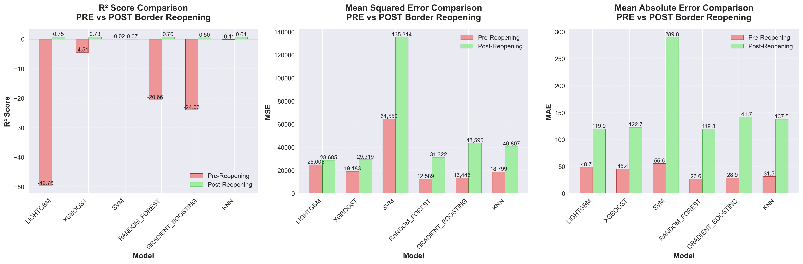
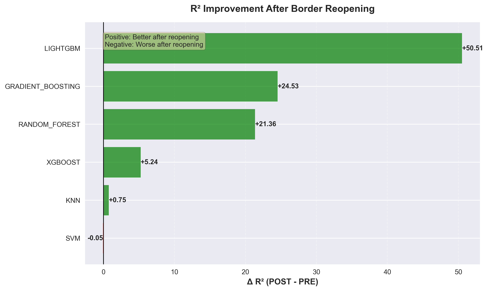
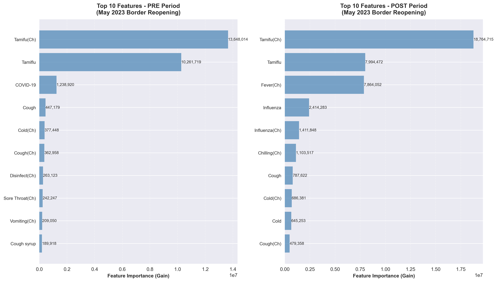
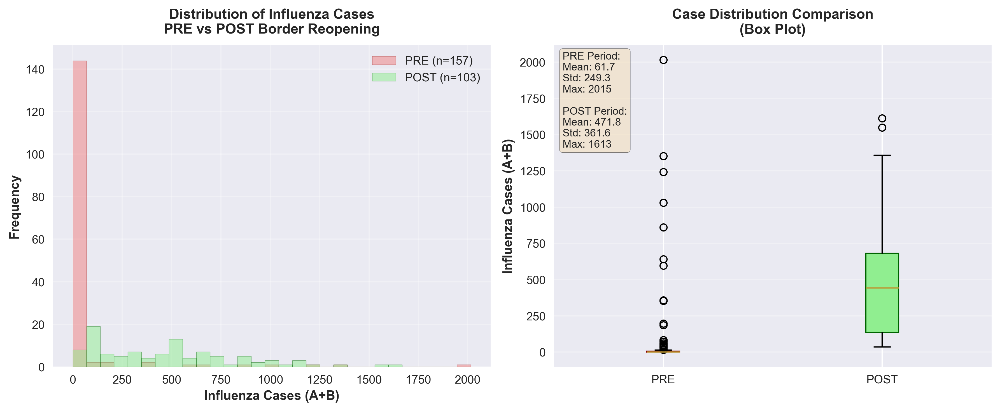
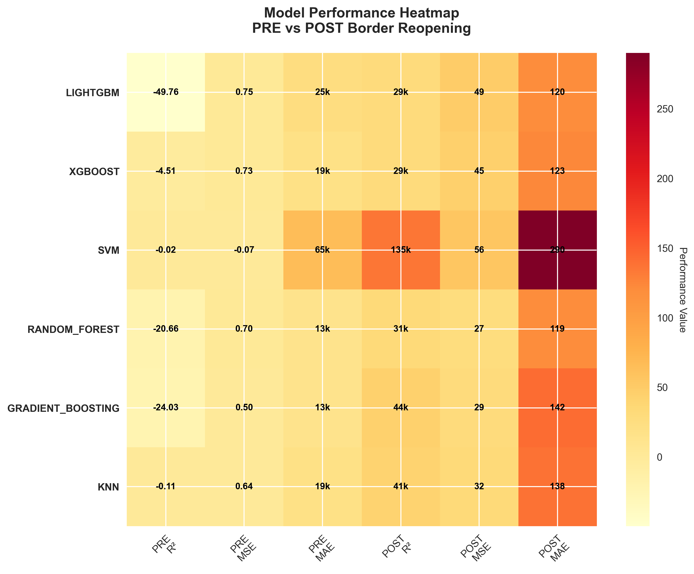
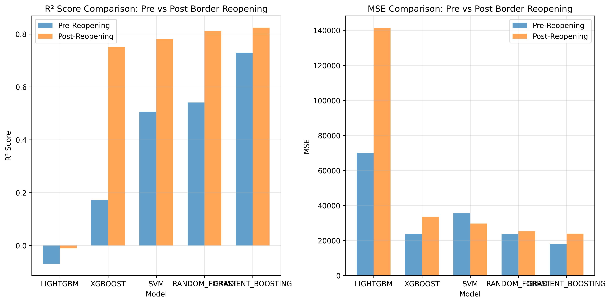
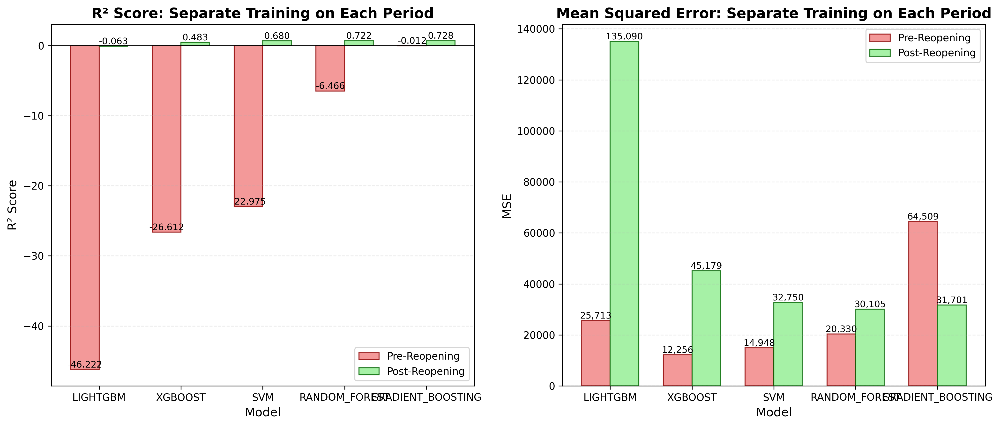

# Influenza-Epidemic-Data-Analysis-Public

## 📋 Project Overview

This repository contains a data science project conducted in 2025 investigating the relationship between influenza epidemic data and Google search trends in Hong Kong S.A.R.

## 🎯 Project Intentions

The primary objectives of this project are:

- To analyze correlations between keyword search trends on Google and actual influenza cases during the same periods
- To examine data from 2020-2025 to gain insights into the potential impact of the COVID-19 epidemic on influenza patterns and public search behavior

## 📊 Data Sources

### Google Trends Data
- **Source:** [Google Trends API](https://trends.google.com/trends/)
- **Method:** Data fetched via API
- **Content:** Search volume trends for influenza-related keywords

### Influenza Epidemic Data
- **Source:** [Hong Kong Government Open Data Portal](https://data.gov.hk/en-data/dataset/hk-dh-chpsebcddr-flu-express)
- **Dataset:** Flu Express - Weekly influenza surveillance data from the Centre for Health Protection
- **Key Metric:** Weekly new influenza cases (Column: **A+B**)

## 📁 Repository Structure

```
Influenza-Epidemic-Data-Analysis-Public/
├── data/
│   ├── raw/
│   │   ├── __init__.py
│   │   ├── extract.py              # Data loading functions
│   │   ├── query_trend.csv
│   │   └── flux_data.csv
│   └── processed/
├── src/
│   ├── __init__.py
│   ├── models/                    # Model implementations
│   │   ├── __init__.py
│   │   ├── regression.py          # Regression model training
│   │   └── feature_selection.py   # Feature selection
│   ├── experiments/              # Experiment scripts
│   │   ├── __init__.py
│   │   └── main_experiment.py    # Main experiment runner
│   └── utils/                    # Utility functions
│       ├── __init__.py
│       ├── metrics.py            # Evaluation metrics
│       ├── visualization.py      # Plotting functions
│       └── helpers.py            # Helper functions
├── results/                      # Generated results
├── requirements.txt
└── README.md
```

## 🚀 Getting Started

### Prerequisites
- Python 3.8+
- Required Python packages (see `requirements.txt`)

### Installation
```bash
git clone https://github.com/DavidPanGithub/Influenza-Epidemic-Data-Analysis-Public.git
cd Influenza-Epidemic-Data-Analysis-Public
pip install -r requirements.txt

## 📈 Research Findings: Impact of Border Reopening on Google Trends Predictability

### Executive Summary
This study analyzes the predictive relationship between Google search trends and influenza cases in Hong Kong, with a focus on the impact of the May 2023 border reopening with Mainland China. Our analysis reveals a dramatic improvement in predictive power following the border reopening, suggesting that Google Trends data becomes a valuable influenza surveillance tool only when normal disease transmission patterns are restored.

### Key Findings

#### 1. Dramatic Model Performance Improvement

*Figure 1: Side-by-side comparison of model performance metrics (R², MSE, MAE) showing dramatic improvement in the POST period*

- **Pre-reopening (2020-2022):** All models showed negative R² values (range: -49.76 to -0.02)
- **Post-reopening (2023-2025):** Models achieved positive R² values (range: 0.50 to 0.75)
- **Average R² improvement:** +17.06 points across all models
- **Best performing model:** LightGBM achieved R² = 0.754 post-reopening

#### 2. Statistical Significance of Results

*Figure 2: R² improvement visualization showing LightGBM with the largest positive change*

- Negative R² pre-reopening: Google search trends had no predictive power for influenza cases during COVID restrictions
- Positive R² post-reopening: Search trends became reliable predictors (R² up to 0.75) after borders reopened
- Most improved model: LightGBM showed +50.51 R² improvement (from -49.76 to 0.75)

### Feature Importance Analysis

*Figure 3: Top feature importance comparison showing stable medication-related features and changing symptom patterns*

#### Stable Top Features
- Tamiflu(Ch) remained the most important predictor in both periods
- Tamiflu (English) maintained second position
- This consistency suggests medication-seeking behavior is a stable indicator

#### Notable Feature Changes
- COVID-19 features disappeared from top predictors post-reopening
- Influenza symptoms (Fever, Cough, Chilling) gained importance
- Bilingual patterns persisted with both Chinese and English terms remaining relevant

### Data Characteristics

*Figure 4: Comparison of influenza case distributions showing return to normal patterns post-reopening*

#### Pre-Period Characteristics (COVID Era)
- **Mean cases:** 62 per week
- **High zero-inflation:** Extended periods with minimal flu transmission
- **Statistical anomaly:** One extreme outlier (2015 cases in April 2023)

#### Post-Period Characteristics (Normal Transmission)
- **Mean cases:** 472 per week (7.6× increase)
- **Normal distribution:** Typical seasonal influenza patterns returned
- **Predictable cycles:** Clear epidemic curves emerged

### Model Performance Details

*Figure 5: Comprehensive heatmap showing all performance metrics across models and periods*

#### Error Metrics Interpretation
- MSE = 28,685 (LightGBM post-reopening) corresponds to ±169 case average error
- MAE = 119.9 cases average absolute error
- 37% relative error (error/mean cases), which is excellent for epidemiological forecasting

#### Model Ranking Post-Reopening
1. LightGBM (R² = 0.754) - Best overall performance
2. XGBoost (R² = 0.726) - Close second
3. Random Forest (R² = 0.699) - Consistent performer
4. KNN (R² = 0.637) - Moderate performance
5. Gradient Boosting (R² = 0.502) - Lowest tree-based performance
6. SVM (R² = -0.065) - Consistently poor across both periods


*Additional Figure: Detailed model comparison across different evaluation metrics*


*Additional Figure: Analysis of pre- and post-reopening periods separately*
